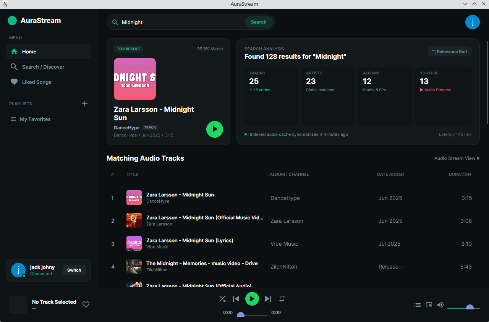

<div align="center">

# 🎵 AuraStream

**A modern, lightweight desktop audio player and streaming suite built with .NET 10 & Avalonia UI.**

[](https://github.com/cyberps96/AuraStream/releases)
[](https://dotnet.microsoft.com/)
[](https://avaloniaui.net/)
[](https://github.com/cyberps96/AuraStream)
[](LICENSE)

*Stream music seamlessly from YouTube Music with a modern Spotify-inspired dark emerald interface, dynamic playlist management, and native LibVLC audio.*

<br/>



</div>

---

## ✨ Features

- **🎧 High-Fidelity Audio Streaming**: Powered by native LibVLC and YoutubeExplode for low-latency, gapless playback.
- **🎨 Modern Dark Emerald Interface**: Crafted with Avalonia UI, scalable vector icons, fluent design, and responsive layouts.
- **🔍 Instant Search & Discovery**: Search songs, artists, and albums in real time with interactive top results and audio metadata analysis.
- **📑 Playlist & Library Management**: Create, organize, and manage custom playlists and Liked Songs with full right-click context menu control.
- **⚡ Smart Stream Caching**: In-memory caching and predictive preloading of adjacent tracks for instant, interruption-free track switching.
- **🔒 Google Account Integration**: Seamless 1-click browser sign-in syncing account name and avatar picture securely.
- **🎛️ Responsive Player Controls**: Microsecond-accurate seek slider, persistent volume controls, and deterministic play/pause state synchronization.

---

## 🛠️ Tech Stack

| Component | Technology | Description |
| :--- | :--- | :--- |
| **Runtime** | [.NET 10](https://dotnet.microsoft.com/) | High-performance C# runtime |
| **GUI Framework** | [Avalonia UI](https://avaloniaui.net/) | Cross-platform XAML GUI |
| **Audio Engine** | [LibVLCSharp](https://code.videolan.org/videolan/LibVLCSharp) | Native LibVLC C binding for robust audio decoding |
| **Stream Extraction** | [YoutubeExplode](https://github.com/Tyrrrz/YoutubeExplode) | YouTube stream resolution and metadata extraction |
| **Image Loading** | [AsyncImageLoader.Avalonia](https://github.com/IvanJosipovic/AsyncImageLoader.Avalonia) | High-performance async thumbnail rendering |

---

## 🚀 Installation & Getting Started

### Option 1: Pre-built Binary (Recommended)
You don't need .NET installed to run AuraStream. Download the latest self-contained standalone build from [GitHub Releases](https://github.com/cyberps96/AuraStream/releases/latest):

1. **System Prerequisite (LibVLC)**:
   - **Arch / CachyOS / Manjaro**: `sudo pacman -S vlc`
   - **Ubuntu / Debian**: `sudo apt install vlc libvlc-dev`
   - **Fedora**: `sudo dnf install vlc vlc-devel`

2. **Download & Run**:
   ```bash
   # Extract the downloaded archive
   tar -xzf AuraStream-v1.0.0-linux-x64.tar.gz
   cd AuraStream-v1.0.0-linux-x64

   # Launch AuraStream
   ./AuraStream
   ```

---

### Option 2: Build from Source
If you prefer compiling directly from source:

1. **Prerequisites**:
   - Install [.NET 10 SDK](https://dotnet.microsoft.com/download/dotnet/10.0)
   - Install `libvlc` (see above)

2. **Clone & Run**:
   ```bash
   git clone https://github.com/cyberps96/AuraStream.git
   cd AuraStream
   dotnet build
   dotnet run
   ```

---

## 📂 Project Structure

```text
AuraStream/
├── Models/
│   ├── PlaylistModel.cs         # Playlist data contracts
│   └── TrackItem.cs             # Track metadata & playback state
├── Services/
│   ├── AudioEngine.cs           # LibVLC audio playback & event engine
│   ├── AuthManager.cs           # Google profile & session management
│   ├── BrowserAuthService.cs    # Chromium CDP 1-click Google auth
│   ├── PlaylistManager.cs       # Persistent local playlist storage
│   └── StreamCacheService.cs    # YouTube audio stream resolver & cache
├── Views/
│   ├── CreatePlaylistDialog.*   # Playlist creation dialog
│   └── LoginWindow.*            # Google sign-in modal window
├── App.axaml                    # Application styling & FluentTheme
├── MainWindow.axaml             # Main desktop player view
├── Program.cs                   # Application entry point
└── sopfiy.csproj                # Project dependencies & build config
```

---

## 🤝 Contributing

Contributions, issues, and feature requests are welcome!
Feel free to check the [issues page](https://github.com/cyberps96/AuraStream/issues) if you want to contribute.

---

## 📄 License

This project is licensed under the MIT License - see the [LICENSE](LICENSE) file for details.
